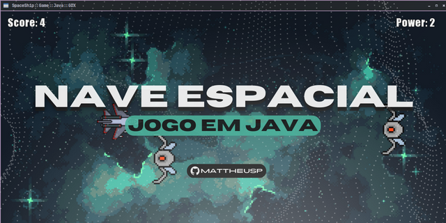

# Jogo de Nave Espacial com Java :rocket:

Este é um jogo de nave espacial desenvolvido em Java. O objetivo do jogo é pilotar uma nave espacial e destruir inimigos enquanto desvia de obstáculos. O jogo é executado em uma janela gráfica e utiliza os recursos gráficos e de áudio da biblioteca JavaFX.



## Funcionalidades :video_game:

- Movimentação da nave espacial usando as teclas de seta (cima, baixo, esquerda, direita).
- Disparo de projéteis pela nave para destruir os inimigos.
- Inimigos que se movem em direção à nave do jogador.
- Geração aleatória de obstáculos que o jogador deve desviar.
- Pontuação para cada inimigo destruído.
- Controle de vidas do jogador.
- Efeitos sonoros para ações como disparo de projéteis e colisões.

## Pré-requisitos :clipboard:

Certifique-se de ter as seguintes ferramentas instaladas antes de executar o jogo:

- Java Development Kit (JDK) 8 ou superior
- JavaFX SDK

## Como Executar :arrow_forward:

1. Clone este repositório para sua máquina local:

   ```shell
   git clone https://github.com/seu-usuario/jogo-nave-espacial-java.git


## Como Jogar :joystick:

    Use as teclas de seta para mover a nave espacial.
    Pressione a barra de espaço para disparar projéteis.
    Desvie dos obstáculos e evite colidir com os inimigos.
    Aumente sua pontuação destruindo os inimigos.
    O jogo termina quando o jogador perde todas as vidas.


## Contribuição :raising_hand:

Contribuições são bem-vindas! Se você encontrar algum problema ou tiver sugestões de melhorias, por favor, abra uma issue neste repositório.


## Contato ✉️

- E-mail: mattheusp382@gmail.com
- LinkedIn: [Mattheus-Pereira](https://www.linkedin.com/in/mattheuspereira/)
- Instagram - https://www.instagram.com/mattheusp_dev/
- Portfólio: [seu-website.com](https://www.seu-website.com)


## Uso 🛠️

Para utilizar o relógio dinâmico em seu projeto, siga as etapas abaixo:

1. Faça um clone deste repositório ou baixe os arquivos ZIP.
2. Abra o arquivo `index.html` em seu navegador web.

```bash
git clone https://github.com/mattheusp/relogio-dinamico_HTML_CSS_JS

## Licença ⚖️

Este projeto está licenciado sob a Licença MIT(https://opensource.org/licenses/MIT) - consulte o arquivo [LICENSE.md](LICENSE.md) para obter mais detalhes.